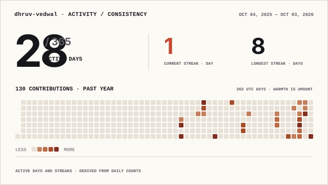
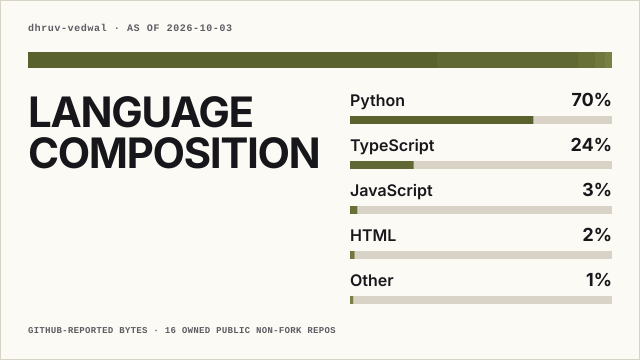

 

# Dhruv Vedwal

### I build things, learn a lot, and keep making them better.

I like taking a rough idea, turning it into something real, and then figuring out all the parts I didn't know yet.

 

<a href="https://github.com/dhruv-vedwal">GitHub</a>
&nbsp;&nbsp;·&nbsp;&nbsp;
<a href="https://www.linkedin.com/in/dhruv-vedwal/">LinkedIn</a>

 

<table>
<tr>
<td width="50%" valign="top">

### building

Software around **AI, automation and the web** — especially ideas where the computer has to understand what someone is trying to do and help make it happen.

</td>
<td width="50%" valign="top">

### learning

I'm learning **AI more seriously** now: going beyond simply using models and understanding how intelligent software is built, how information moves through it, and how the pieces fit together.

</td>
</tr>
</table>

 

`web apps` &nbsp; `automation` &nbsp; `AI` &nbsp; `developer tools` &nbsp; `systems`

---

## things I use

---

## GitHub, lately

<picture>
  <source media="(prefers-color-scheme: dark)" srcset="./profile/activity-consistency-wide-dark.svg">
  
</picture>

 

<picture>
  <source media="(prefers-color-scheme: dark)" srcset="./profile/language-composition-wide-dark.svg">
  
</picture>

<b>GitHub trophies</b>

 

 

somewhere between building and figuring it out.

