  

 

  <a href="https://github.com/dhruv-vedwal">GitHub</a>
  &nbsp;&nbsp;·&nbsp;&nbsp;
  <a href="https://www.linkedin.com/in/dhruv-vedwal/">LinkedIn</a>

 

<table>
<tr>
<td width="62%" valign="top">

### 01 — NOW

**ProductLens**

A small idea I'm pushing pretty far: give a web app, a prompt, and credentials; let an agent figure out the workflow and turn it into a product demo.

`TypeScript` `Next.js` `Python` `FastAPI` `Playwright` `LLMs`

</td>
<td width="38%" valign="top">

### 02 — INTERESTS

AI agents  
Browser automation  
LLM systems  
Developer tools  
Product engineering

</td>
</tr>
</table>

 

### 03 — TOOLKIT

  

 

### 04 — GITHUB

<table>
<tr>
<td width="50%" valign="top">
  
</td>
<td width="50%" valign="top">
  
</td>
</tr>
</table>

  

 

  

 

  build → break → learn → repeat

